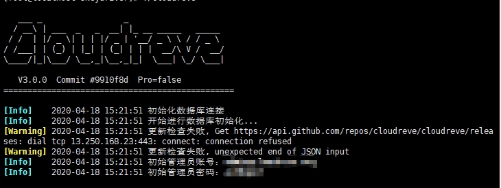

# 使用Cloudreve搭建网盘
<p>
Pandownload倒了,以后下载东西感觉越来越费劲了.前一阵子看各位大佬们都在弄自己的网盘,今天我也玩一玩.可以的话把百度网盘的东西都搬运一下…看来是一件浩大的工程…
</p>
<p>
这里使用Cloudreve来进行搭建,最近好多人都在用这个搭建,所以我也选择这个啦,背靠大树好乘凉嘛!
</p>
<p>
先去<a href="https://github.com/cloudreve/Cloudreve/releases">github</a>下载服务器的相关软件包,我下载的是<code>3.0.0</code>的<code>cloudreve_3.0.0_linux_amd64.tar.gz</code>
</p>
<p>
这里有一个问题就是软件下错了,在服务器执行会提示<code>无法执行二进制文件</code>,所以如果提示这个,可以看一下是不是自己的软件包下的不对.
</p>
<p>
下载好了之后,解压,将里边的文件直接上传到服务器的某个目录,我选择了和我网站根目录并齐的/<code>www/wwwroot</code>下,然后新建一个文件夹<code>skydriver</code>,放到了这个里边
</p>
<p>
之后执行下边的命令
</p>

```bash
# 进入到相关目录
cd /www/wwwroot/skydriver
# 为cloudreve赋予执行权限
chmod +x ./cloudreve
# 执行cloudreve
./cloudreve
```

<p>
如果出现下图即运行成功,否则可能会出现上边说的<code>无法执行二进制文件</code>的情况.
</p>


<p>
出现该界面之后,将初始管理员账号和密码记下来一会使用.
</p>

```bash
# 停止运行该程序
CTRL+C
 
# 编辑配置文件.使用vi编写并创建该配置文件
vi /usr/lib/systemd/system/cloudreve.service
```

<p>
然后在该文件中输入下边的配置信息,<code>[Service]</code>中的两处<code>PATH_TO_CLOUDREVE</code>修改为刚刚的上传目录,我的目录即为<code>/www/wwwroot/skydriver</code>
</p>

```properties
[Unit]
Description=Cloudreve
Documentation=https://docs.cloudreve.org
After=network.target
Wants=network.target
[Service]
WorkingDirectory=/PATH_TO_CLOUDREVE
ExecStart=/PATH_TO_CLOUDREVE/cloudreve
Restart=on-abnormal
RestartSec=5s
KillMode=mixed
 
StandardOutput=null
StandardError=syslog
[Install]
WantedBy=multi-user.target
```

<p>
配置好之后保存,执行下边的命令.这样就可以启动守护进程了
</p>
<p>
这里用的是centos7,所以使用<code>systemctl</code>命令
</p>
<p>
开启之后可以使用ip:5212进行访问.在linux或者宝塔需要放行5212端口.
</p>

```bash
# 更新配置
systemctl daemon-reload
# 启动服务
systemctl start cloudreve
# 设置开机启动
systemctl enable cloudreve
```

<p>
如果想要对cloudreve进行一些操作可以参考下边的命令
</p>

```bash
# 启动服务
systemctl start cloudreve
# 停止服务
systemctl stop cloudreve
# 重启服务
systemctl restart cloudreve
# 查看状态
systemctl status cloudreve
```

[cloudreve官网](https://cloudreve.org/)

# Linux部署ss或ssr
<p>
ss的配置
</p>

```bash
git clone -b master https://github.com/flyzy2005/ss-fly #从github克隆ss组件
 
ss-fly/ss-fly.sh -i lightly 1024 #通过脚本设置ss的密码和端口
```
<p>
这里<code>lightly</code>是ss密码.<code>1024</code>是ss运行端口,都可以修改为自己的.安装之后会有如下提示
</p>

```bash
你的服务器地址(IP):114.114.114.114
你的密码         :lightly
你的端口         :1024
你的加密方式      :aes-256-cfb
...
```

<p>
使用的时候只需要使用ss的链接即可访问
</p>

```bash
ss-fly/ss-fly.sh -uninstall #ss卸载
```

<p>
ssr的配置(和ss相仿)
</p>

```bash
git clone -b master https://github.com/flyzy2005/ss-fly #从github克隆ssr组件
 
ss-fly/ss-fly.sh -ssr #运行ssr脚本
```

<p>
其中<code>密码</code>和<code>端口</code>可以设置自己的,也可以用默认的,其他的选项用默认即可.最终同样会提示ssr的链接,复制到小飞机即可访问.
</p>

> 如果有提示 `bash: git: command not found` 表示git没有安装,可以使用如下命令
> ```bash
> yum -y install git #centos
> apt-get -y install git #ubuntu或debian
> ```