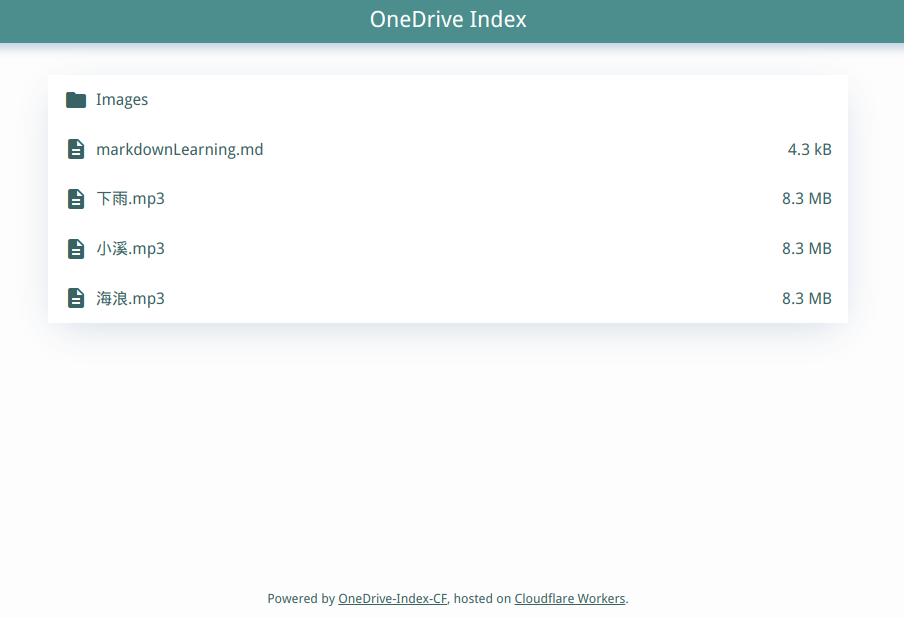
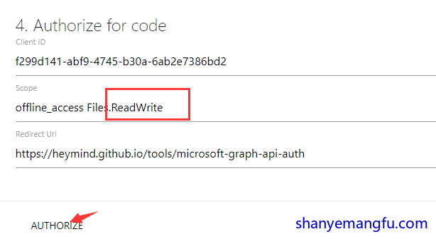

# cloudflare搭建OneDrive
* 访问链接

```
https://od.lightly.ml
```

* cloudflare搭建OneDrive
  
[项目地址](https://github.com/heymind/OneDrive-Index-Cloudflare-Worker)
* 新建APP应用(访问[该链接](https://portal.azure.com/#blade/Microsoft_AAD_IAM/ActiveDirectoryMenuBlade/RegisteredApps)新建应用)

```
账户    xxxxx@xxxxx.onmicrosoft.com
密码    123321123321
重定向url    https://heymind.github.io/tools/microsoft-graph-api-auth
```

  * 相关流程图
    *   
      这里需要将`client_id`记下来
    *   
        
        
      这里需要将密码保存为`client_secret`
    * 
      添加API权限,需要有`offline_access`, `Files.Read`, `Files.Read.All`
    * 获取[refresh_token](https://heymind.github.io/tools/microsoft-graph-api-auth)
      填入`Client ID`,获取`code`(`code`比较长)
      
    * 填入`Client ID`, `Client Secret`, `Code`, 点击`GET TOKEN`获取`refresh_token`
      
    * 
      搜索`refresh_token`，然后复制，引号内的都是  
      如果这里的`refresh_token`获取时有跨域报错  
      ```plain
        AADSTS9002326: Cross-origin token redemption is permitted only for the 'Single-Page Application' client-type
      ```  
      那么可以使用Postman进行请求
      ```yml
        请求url: https://login.microsoftonline.com/common/oauth2/v2.0/token
        请求方法: GET
        请求参数: 需要使用body的x-www-form-urlencoded
            grant_type: authorization_code
            code: 刚刚页面获取的code
            redirect_uri: https://heymind.github.io/tools/microsoft-graph-api-auth
            client_id: 刚刚注册时获取的client_id
            client_secret: 刚刚注册时获取的client_secret
      ```  
      然后响应体里有refresh_token, 此处[参考](https://blog.imzjw.cn/posts/cf-onedrive/)了这里
  * 从APP获取的相应参数

```
client_id: 1231231233213213211
client_secret: 123321qweewqrter
refresh_token: asdffdsa.asdffdsa.asdffdsa
```

  * worker新建代码

```javascript
const config = {
    /**
     * You can use this tool http://heymind.github.io/tools/microsoft-graph-api-auth
     * to get following params: client_id, client_secret, refresh_token & redirect_uri.
     */
    "refresh_token": "asdffdsa.asdffdsa.asdffdsa",
    "client_id": "1231231233213213211",
    "client_secret": "123321qweewqrter",
    "redirect_uri": "https://heymind.github.io/tools/microsoft-graph-api-auth",
    /**
     * The base path for indexing, all files and subfolders are public by this tool. For example `/Share`.
     */
    base: "/",
    /**
     * Feature Caching
     * Enable Cloudflare cache for path pattern listed below.
     * Cache rules:
     * - Entire File Cache  0 < file_size < entireFileCacheLimit
     * - Chunked Cache     entireFileCacheLimit  <= file_size < chunkedCacheLimit
     * - No Cache ( redirect to OneDrive Server )   others
     * 
     * Difference between `Entire File Cache` and `Chunked Cache`
     * 
     * `Entire File Cache` requires the entire file to be transferred to the Cloudflare server before 
     *  the first byte sent to a client.
     * 
     * `Chunked Cache` would stream the file content to the client while caching it.
     *  But there is no exact Content-Length in the response headers. ( Content-Length: chunked )
     * 
     */
    "cache": {
        "enable": false,
        "entireFileCacheLimit": 10000000, // 10MB
        "chunkedCacheLimit": 100000000, // 100MB 
        "paths": ["/Images"]
    },
    /**
     * Feature Thumbnail
     * Show a thumbnail of image by ?thumbnail=small (small,medium,large)
     * more details: https://docs.microsoft.com/en-us/onedrive/developer/rest-api/api/driveitem_list_thumbnails?view=odsp-graph-online#size-options
     * example: https://storage.idx0.workers.dev/Images/def.png?thumbnail=mediumSquare
     *  
     */
    "thumbnail": true,
    /**
     * Small File Upload ( <= 4MB )
     * example: POST https://storage.idx0.workers.dev/Images/?upload=<filename>&key=<secret_key>
     */
    "upload": {
        "enable": false,
        "key": "your_secret_1key_here"
    },
    /**
     * Feature Proxy Download
     * Use Cloudflare as a relay to speed up download. ( especially in Mainland China )
     * example: https://storage.idx0.workers.dev/Images/def.png?proxied
     */
    "proxyDownload": true,
};

/**
 * Basic authentication.
 * Disabled by default (Issue #29)
 * 
 * AUTH_ENABLED   to enable auth set true
 * NAME           user name
 * PASS           password
 */
const AUTH_ENABLED = false
const NAME = "admin"
const PASS = "password"

/**
 * RegExp for basic auth credentials
 *
 * credentials = auth-scheme 1*SP token68
 * auth-scheme = "Basic" ; case insensitive
 * token68     = 1*( ALPHA / DIGIT / "-" / "." / "_" / "~" / "+" / "/" ) *"="
 */

const CREDENTIALS_REGEXP = /^ *(?:[Bb][Aa][Ss][Ii][Cc]) +([A-Za-z0-9._~+/-]+=*) *$/

/**
 * RegExp for basic auth user/pass
 *
 * user-pass   = userid ":" password
 * userid      = *<TEXT excluding ":">
 * password    = *TEXT
 */

const USER_PASS_REGEXP = /^([^:]*):(.*)$/

/**
 * Object to represent user credentials.
 */

const Credentials = function(name, pass) {
  this.name = name
  this.pass = pass
}

/**
 * Parse basic auth to object.
 */

const parseAuthHeader = function(string) {
  if (typeof string !== 'string') {
    return undefined
  }

  // parse header
  const match = CREDENTIALS_REGEXP.exec(string)

  if (!match) {
    return undefined
  }

  // decode user pass
  const userPass = USER_PASS_REGEXP.exec(atob(match[1]))

  if (!userPass) {
    return undefined
  }

  // return credentials object
  return new Credentials(userPass[1], userPass[2])
}


const unauthorizedResponse = function(body) {
  return new Response(
    null, {
      status: 401,
      statusText: "'Authentication required.'",
      body: body,
      headers: {
        "WWW-Authenticate": 'Basic realm="User Visible Realm"'
      }
    }
  )
}

async function handle(request) {
    if (AUTH_ENABLED == false) {
        return handleRequest(request)
    } else if (AUTH_ENABLED == true) {
        const credentials = parseAuthHeader(request.headers.get("Authorization"))
        if (!credentials || credentials.name !== NAME || credentials.pass !== PASS) {
            return unauthorizedResponse("Unauthorized")
        } else {
            return handleRequest(request)
        }
    } else {
        console.info("Auth error unexpected.")
    }
}

addEventListener('fetch', event => {
    event.respondWith(handle(event.request))
})

/**
 * Current access token 
 */
let _accessToken = null;

/**
 * Cloudflare cache instance
 */
let cache = caches.default;

/**
 * Get access token for microsoft graph API endpoints. Refresh token if needed.
 */
async function getAccessToken() {
    if (_accessToken) return _accessToken;
    resp = await fetch("https://login.microsoftonline.com/common/oauth2/v2.0/token", {
        method: "POST",
        body: `client_id=${config.client_id}&redirect_uri=${config.redirect_uri}&client_secret=${config.client_secret}
    &refresh_token=${config.refresh_token}&grant_type=refresh_token`,
        headers: {
            "Content-Type": "application/x-www-form-urlencoded"
        }
    });
    if (resp.ok) {
        console.info("access_token refresh success.")
        const data = await resp.json()
        _accessToken = data.access_token
        return _accessToken;
    } else throw `getAccessToken error ${ JSON.stringify(await resp.text())}`
}


/**
 * mimetype to Material Icon name
 * @param {string} ype 
 */
function mime2icon(type) {
    if (type.startsWith("image")) return "image";
    if (type.startsWith("image")) return "video_label";
    if (type.startsWith("image")) return "audiotrack";
    return "description";
}

/**
 * Cache downloadUrl according to caching rules.
 * @param {Request} request client's request 
 * @param {integer} fileSize 
 * @param {string} downloadUrl 
 * @param {function} fallback handle function if the rules is not satisfied
 */
async function setCache(request, fileSize, downloadUrl, fallback) {
    if (fileSize < config.cache.entireFileCacheLimit) {
        console.info(`Cache entire file ${request.url}`);
        const remoteResp = await fetch(downloadUrl);
        const resp = new Response(remoteResp.body, {
            headers: {
                "Content-Type": remoteResp.headers.get("Content-Type"),
                "ETag": remoteResp.headers.get("ETag"),
            },
            status: remoteResp.status,
            statusText: remoteResp.statusText,
        });
        await cache.put(request, resp.clone());
        return resp;

    } else if (fileSize < config.cache.chunkedCacheLimit) {
        console.info(`Chunk cache file ${request.url}`);
        const remoteResp = await fetch(downloadUrl);
        let {
            readable,
            writable
        } = new TransformStream();
        remoteResp.body.pipeTo(writable);
        const resp = new Response(readable, {
            headers: {
                "Content-Type": remoteResp.headers.get("Content-Type"),
                "ETag": remoteResp.headers.get("ETag")
            },
            status: remoteResp.status,
            statusText: remoteResp.statusText
        });
        await cache.put(request, resp.clone());
        return resp;

    } else {
        console.info(`No cache ${request.url} because file_size(${fileSize}) > limit(${config.cache.chunkedCacheLimit})`);
        return await fallback(downloadUrl);
    }
}
/**
 * Redirect to the download url.
 * @param {string} downloadUrl 
 */
async function directDownload(downloadUrl) {
    console.info(`DirectDownload -> ${downloadUrl}`);
    return new Response(null, {
        status: 302,
        headers: {
            "Location": downloadUrl.slice(6)
        }
    });
}
/**
 * Download a file using Cloudflare as a relay.
 * @param {string} downloadUrl 
 */
async function proxiedDownload(downloadUrl) {
    console.info(`ProxyDownload -> ${downloadUrl}`);
    const remoteResp = await fetch(downloadUrl);
    let {
        readable,
        writable
    } = new TransformStream();
    remoteResp.body.pipeTo(writable);
    return new Response(readable, remoteResp);
}


async function handleFile(request, pathname, downloadUrl, {
    proxied = false,
    fileSize = 0
}) {
    if (config.cache && config.cache.enable &&
        config.cache.paths.filter(p => pathname.startsWith(p)).length > 0) {
        return setCache(request, fileSize, downloadUrl, proxied ? proxiedDownload : directDownload);
    }
    return (proxied ? proxiedDownload : directDownload)(downloadUrl);
}

async function handleUpload(request, pathname, filename) {
    const url = `https://graph.microsoft.com/v1.0/me/drive/root:${config.base+(pathname.slice(-1) == "/" ? pathname :pathname + "/") }${filename}:/content`;
    return await fetch(url, {
        method: "PUT",
        headers: {
            "Authorization": `bearer ${await getAccessToken()}`,
            ...request.headers
        },
        body: request.body
    });
}

function wrap_pathname(pathname) {
    pathname = config.base + (pathname == "/" ? "" : pathname);
    return (pathname === "/" || pathname === "") ? "" : ":" + pathname;
}


async function handleRequest(request) {

    if (config.cache && config.cache.enable) {
        const maybeResponse = await cache.match(request);
        if (maybeResponse) return maybeResponse;
    }

    const base = config.base;
    const accessToken = await getAccessToken();

    const {
        pathname,
        searchParams
    } = new URL(request.url);

    const thumbnail = config.thumbnail ? searchParams.get("thumbnail") : false;
    const proxied = config.proxyDownload ? (searchParams.get("proxied") === null ? false : true) : false;


    if (thumbnail) {
        const url = `https://graph.microsoft.com/v1.0/me/drive/root:${base+(pathname == "/" ? "" :pathname) }:/thumbnails/0/${thumbnail}/content`;
        const resp = await fetch(url, {
            headers: {
                "Authorization": `bearer ${accessToken}`
            }
        });

        return await handleFile(request, pathname, resp.url, {
            proxied
        });

    }

    const url = `https://graph.microsoft.com/v1.0/me/drive/root${ wrap_pathname(pathname) }?select=name,eTag,size,id,folder,file,%40microsoft.graph.downloadUrl&expand=children(select%3Dname,eTag,size,id,folder,file)`;
    const resp = await fetch(url, {
        headers: {
            "Authorization": `bearer ${accessToken}`
        }
    });
    let error = null;
    if (resp.ok) {
        const data = await resp.json();
        if ("file" in data) {
            return await handleFile(request, pathname, data["@microsoft.graph.downloadUrl"], {
                proxied,
                fileSize: data["size"]
            });

        } else if ("folder" in data) {
            if (config.upload && request.method == "POST") {
                const filename = searchParams.get("upload");
                const key = searchParams.get("key");
                if (filename && key && config.upload.key == key) {
                    return await handleUpload(request, pathname, filename);
                } else {
                    return new Response(body, {
                        status: 400
                    });
                }

            }
            if (!request.url.endsWith("/")) return Response.redirect(request.url + "/", 302)
            return new Response(renderFolderIndex(data.children, pathname == "/"), {
                headers: {
                    'Access-Control-Allow-Origin': '*',
                    'content-type': 'text/html'
                }
            });
        } else {
            error = `unknown data ${JSON.stringify(data)}`;
        }
    } else {
        error = (await resp.json()).error;
    }

    if (error) {
        const body = JSON.stringify(error);
        switch (error.code) {
            case "ItemNotFound":
                return new Response(body, {
                    status: 404,
                    headers: {
                        'content-type': 'application/json'
                    }
                });
            default:
                return new Response(body, {
                    status: 500,
                    headers: {
                        'content-type': 'application/json'
                    }
                });
        }

    }
}
/**
 * Render Folder Index
 * @param {*} items 
 * @param {*} isIndex don't show ".." on index page.
 */
function renderFolderIndex(items, isIndex) {
    const nav = `<nav><a class="brand">OneDrive Index</a></nav>`;
    const el = (tag, attrs, content) => `<${tag} ${attrs.join(" ")}>${content}</${tag}>`;
    const div = (className, content) => el("div", [`class=${className}`], content);
    const item = (icon, filename, size) => el("a", [`href="${filename}"`, `class="item"`, size ? `size="${size}"` : ""], el("i", [`class="material-icons"`], icon) + filename)

    return renderHTML(nav + div("container", div("items", el("div", ['style="min-width:600px"'],
        (!isIndex ? item("folder", "..") : "") +
        items.map((i) => {
            if ("folder" in i) {
                return item("folder", i.name, i.size)
            } else if ("file" in i) {
                return item(mime2icon(i.file.mimeType), i.name, i.size)
            } else console.log(`unknown item type ${i}`)
        }).join("")
    ))));
}


function renderHTML(body) {
    return `<!DOCTYPE html>
  <html lang="en">
    <head>
      <meta charset="utf-8" />
      <meta http-equiv="x-ua-compatible" content="ie=edge, chrome=1" />
      <meta name="viewport" content="width=device-width, initial-scale=1, maximum-scale=1">
      <title>OneDrive Index</title>
      <link href='https://fonts.loli.net/icon?family=Material+Icons' rel='stylesheet'>
      <link href='https://cdn.jsdelivr.net/gh/heymind/OneDrive-Index-Cloudflare-Worker/themes/material.css' rel='stylesheet'>
      <link rel="stylesheet" href="https://cdn.jsdelivr.net/npm/prismjs@1.17.1/themes/prism-solarizedlight.css">
      <script type="module" src='https://cdn.jsdelivr.net/gh/heymind/OneDrive-Index-Cloudflare-Worker/script.js'></script>
    </head>
    <body>
      ${body}
      <div style="flex-grow:1"></div>
      <footer><p>Powered by <a href="https://github.com/heymind/OneDrive-Index-Cloudflare-Worker">OneDrive-Index-CF</a>, hosted on <a href="https://www.cloudflare.com/products/cloudflare-workers/">Cloudflare Workers</a>.</p></footer>
      <script src="https://cdn.jsdelivr.net/npm/prismjs@1.17.1/prism.min.js" data-manual></script>
      <script src="https://cdn.jsdelivr.net/npm/prismjs@1.17.1/plugins/autoloader/prism-autoloader.min.js"></script>
    </body>
  </html>`
}
```


  * 代码中`config`的相关配置信息

```javascript
const config = {
    /**
     * 放refresh_token
     */
    "refresh_token": "asdffdaasdffdsasdfYQ",
    /**
     * client_id
     */
    "client_id": "123tesdfgwer234",
    /**
     * client_secret
     */
    "client_secret": "asdfqwer12346e54",
    /**
     * 重定向链接不需要改
     */
    "redirect_uri": "https://heymind.github.io/tools/microsoft-graph-api-auth",
    /**
     * 放onedrive根目录
     */
    base: "/",
    /**
     * 设置为true,则使用CF缓存功能
     */
    "cache": {
        "enable": false,
        "entireFileCacheLimit": 10000000, // 10MB
        "chunkedCacheLimit": 100000000, // 100MB 
        "paths": ["/Images"]
    },
    /**
     * 开启缩略图
     */
    "thumbnail": true,
    /**
     * 设置为true,可用于上传小文件使用POST上传
     * POST https://storage.idx0.workers.dev/Images/?upload=<filename>&key=<key>
     */
    "upload": {
        "enable": false,
        "key": "your_secret_1key_here"
    },
    /**
     * 使用CF代理下载,修改为true后,下载链接加后缀?proxied
     */
    "proxyDownload": true,
};
/**
 * 设置修改为true,登陆时候需要帐号密码.可以自行修改
 */
const AUTH_ENABLED = false
const NAME = "admin"
const PASS = "password"
```

  * CloudFlare绑定workers的域名
    1. 进入到CF的`Workers`,点击`添加路由`
    2. 为相应的`Worker`分配一个子域名,例如
    ```
    onedrive.lightly.ml/*
    ```
    1. 在`DNS`处添加一个`cname`解析指向worker的域名.

参考教程:  
https://www.shanyemangfu.com/cfw-onedrive.html  
https://www.bilibili.com/video/av89209298/  
https://github.com/heymind/OneDrive-Index-Cloudflare-Worker  
