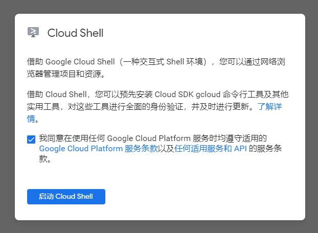
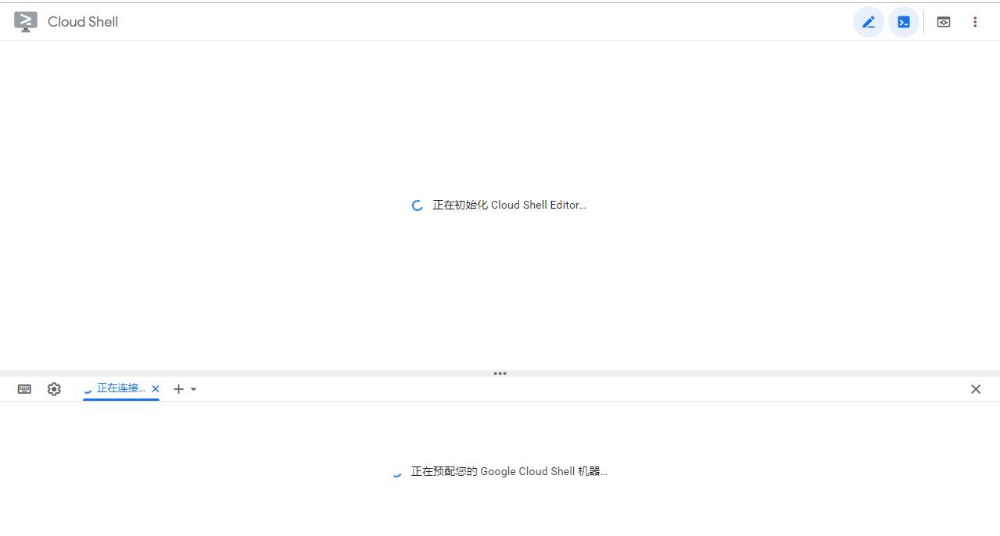
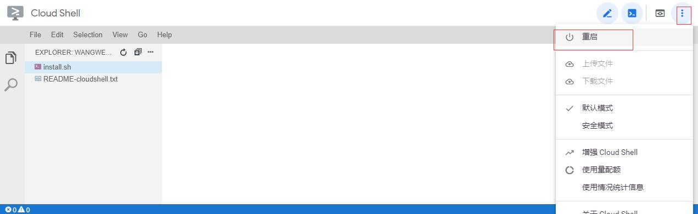
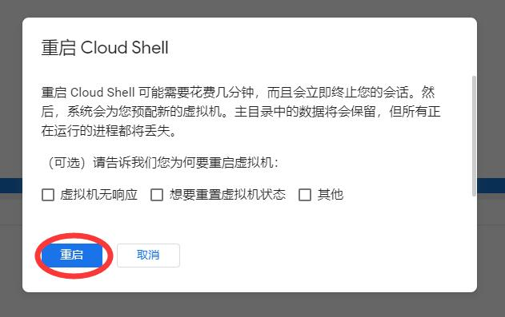
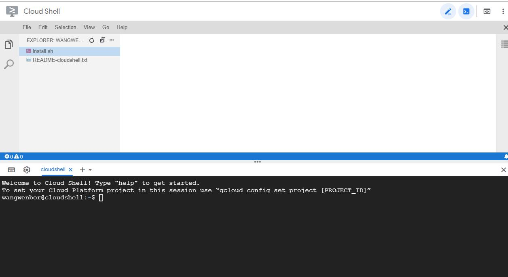
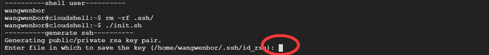
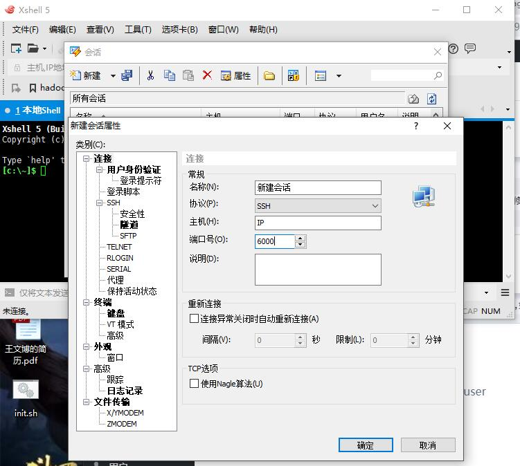

# 使用Google Cloud Shell进行linux练习
<p>
前一阵子发现Google Shell提供每星期50小时的VPS使用时长,所以准备研究研究这个东西.毕竟一直想要搞一个Google的免费VPS,可惜没有信用卡,遂用这个过过瘾把,哈哈!
</p>


<p>
这个东西速度还是挺快的,并且提供5G永久磁盘存储.但是只要你的控制台有一段时间不连接,除了在你的home目录下进行操作的文件会进行保存,其他操作,例如在root下的操作就会丢失.所以进行操作的时候,自己的文件留在自己的用户目录下即可.
</p>

[Google Cloud Shell文档](https://cloud.google.com/shell/docs)

### 优点
1. Google产品,速度很快
2. 每星期50小时,足够练习使用
3. 永久免费使用,纯练习的话可以省去买VPS的钱

### 缺点
1. 每次连接IP会变
2. 长时间不连接VPS自动断开
3. 需要翻墙
4. 文件只能保存到自己的目录下,root目录的操作会自动删除

### 准备材料
1. 翻墙工具,SSH,v2ray等
2. 谷歌邮箱账号
3. xshell
  
### 操作步骤
* 点击[进入](ssh.cloud.google.com),然后登入自己的谷歌账号
* 登入之后,后台会自动为你生成一个在线的shell使用窗口.(默认只能在网页操作)
* 如遇到下图,直接`同意`,然后`启动`即可.

* 启动之后,机器进行自动配置,一会就可以进入

* 如果提示连接不可用,可以点击右上角的三个点=>>重启=>>重启即可重新分配一个机器
  
  
* 出现如下样式即分配成功
  
* 之后在下边的命令行输入以下命令
```bash
#下载自动初始化脚本
wget https://raw.githubusercontent.com/Easul/scripts/master/init.sh
#给初始化脚本赋予执行的权限
chmod +x init.sh
#进入init.sh脚本
vim init.sh
```
* 进入脚本之后输入下边的命令
```bash
:set ff
#如果显示是fileformat=dos,则输入该命令
:set ff=unix
#如果上一行修改了,可以输入这个命令查看是否修改成功
:set ff
#保存退出
:wq
```
* 脚本修改完之后
```bash
#执行脚本初始化,如果遇到输入的地方直接回车,如下图
./init.sh
```
  
* 然后复制控制台的`shell id_rsa`, `shell ip`, `shell user`
* 将`id_rsa`保存到本地的一个文件中,文件名就叫`id_rsa`,没有后缀名
* 点击连接
  * 在主机框输入刚刚复制的`ip`
  * 端口号输入`6000`
* 点击用户身份验证
  * 点击方法选择`Public Key`
  * 用户名输入刚刚复制的`user`
  * 用户密钥处点击浏览=>>导入=>>选择刚刚保存的id-rsa=>>点击该密钥=>>确定=>>确定
  * 在会话中选择自己刚刚新建的会话=>>点击连接即可连接上
  

`注`:
1. 因为下次再登陆,IP和机器会变,但是该脚本会保存在用户目录下,只需要再次执行该脚本,获取`shell id_rsa`, `shell ip`, `shell user`即可
2. `shell`的`id_rsa`不能复制少了,否则连接会出错
3. 浏览器的命令行复制只需要用鼠标选中即复制好,就可以复制到文本里了.